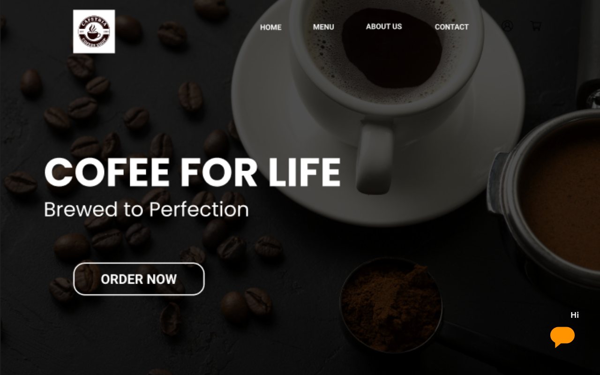
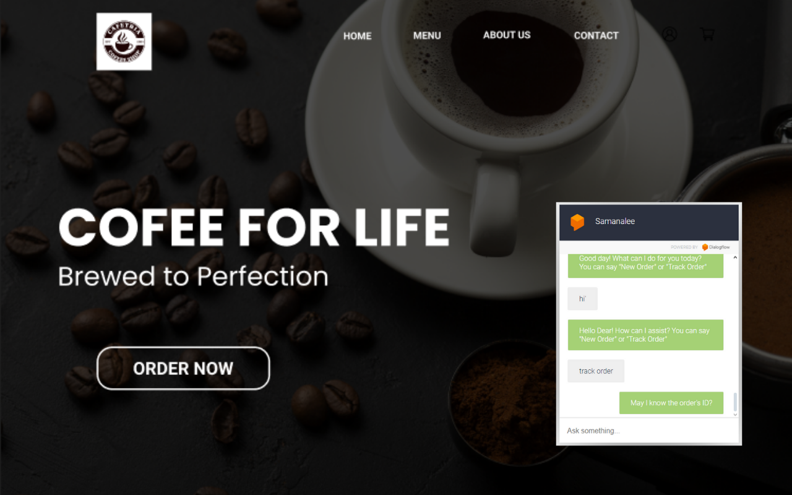
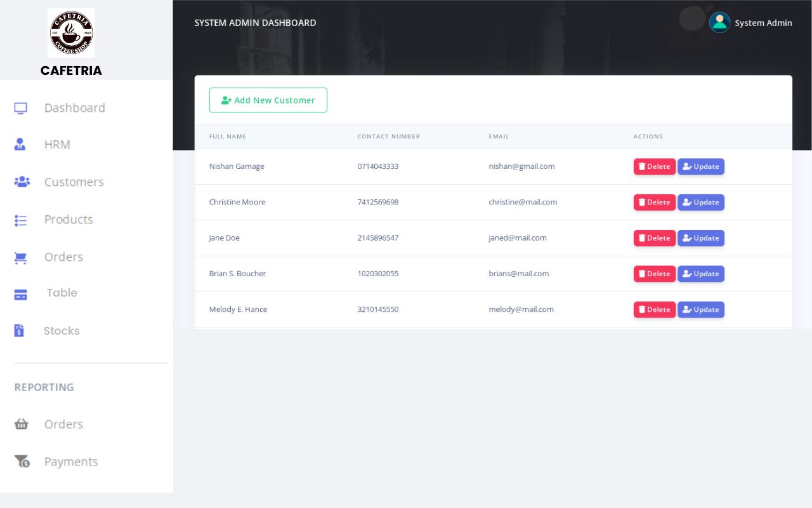
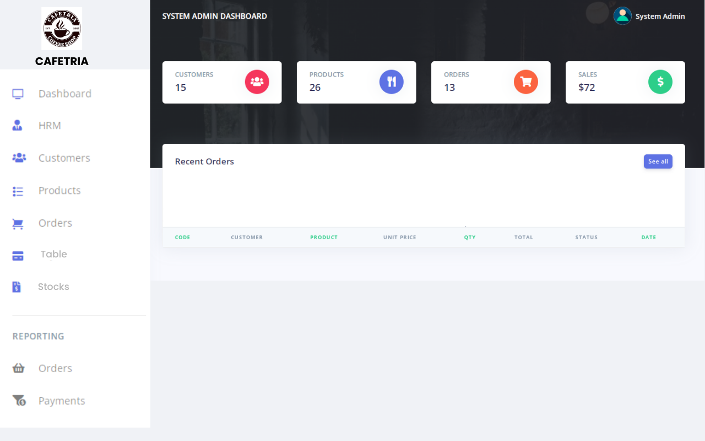
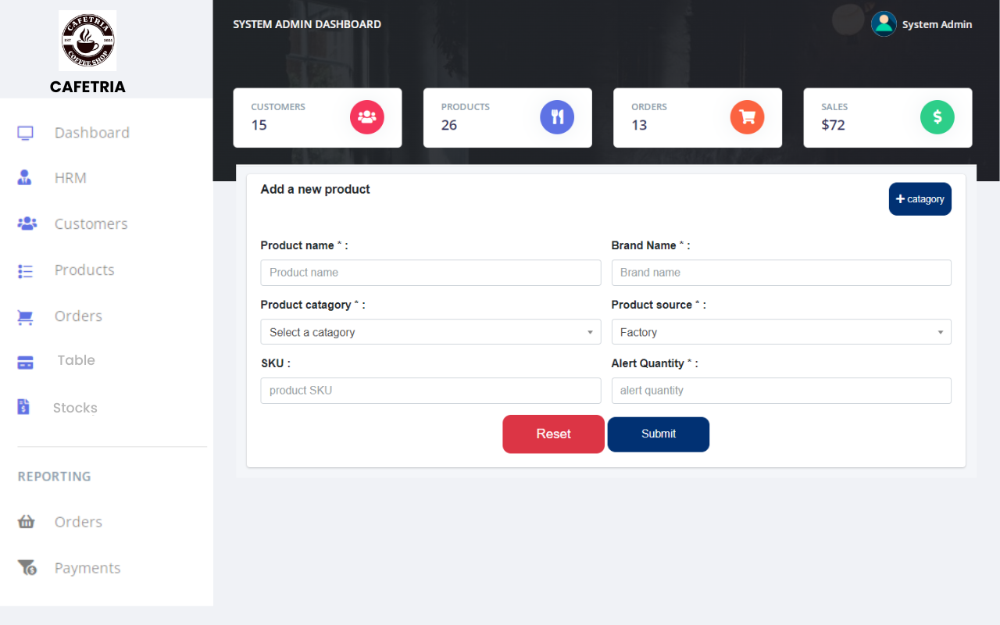

  

<h1 align="center">☕ Cafe Management System</h1>

  A powerful, secure & user-friendly system to manage cafe operations with ease. 
  Featuring real-time menu updates, automated inventory tracking, employee & order management, plus smart CRM and chatbot support.

---

## 🚀 Features

- 🧾 Real-Time Menu Management
- 📦 Smart Inventory Alerts & Auto-Reordering
- 🧑‍🍳 Employee Scheduling & Attendance
- 🛒 Customer Orders & Customization
- 💬 AI Chatbot for 24/7 Customer Interaction
- 🧠 CRM with Loyalty, Feedback & Offers
- 📊 Reports & Analytics (Sales, Stock, Customers)
- 🪑 Optional Table Reservation Management
- 🔐 Admin Access Control + Audit Trails

---

## 🛠️ Built With

  
  
  
  
  

---

## 📸 Screenshots

markdown
### 💻 Dashboard

